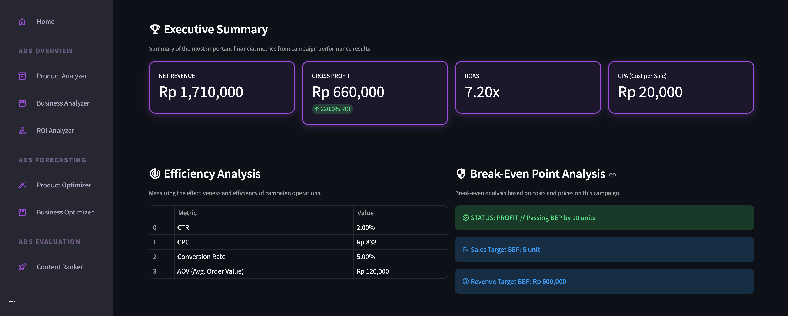
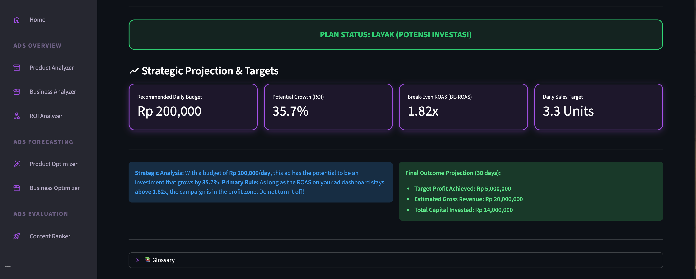

# APEX Suite (Public Demo Version)


---

> **IMPORTANT: This repository is for demonstration purposes only.**
>
> This public repository contains simplified or "lite" versions of the source code. Its primary goal is to showcase the project's documentation and design philosophy.
> The complete, fully functional source code is maintained in a **private repository** and is available upon request during the hiring process.

---

## About The Project

**APEX Suite** is a multi-tool business intelligence dashboard designed for marketers and business owners to turn raw data into profitable, strategic decisions. Built with Python and Streamlit, the suite provides a collection of specialized analyzers and optimizers, each focused on a key aspect of marketing profitability and efficiency.

*This public repository includes:*
-   Complete documentation (`README.md` & `PATCH_NOTES.md`).
-   A sample "lite" version of one of the tools (`Product Analyzer`) to demonstrate UI code.

## The Full Tool Suite (Inquiries)



### 📊 Ads Overview
*Analyze the performance of your campaigns.*
-   **Product Analyzer**
-   **Business Analyzer**
-   **ROI Analyzer**

### 🎯 Ads Forecasting
*Project budgets and set targets for future campaigns.*
-   **Product Optimizer**
-   **Business Optimizer**

### 🏆 Ads Evaluation
*Evaluate and rank the performance of your ad creatives.*
-   **Content Ranker**

## Version History

For a detailed list of all changes and previous versions, see the [**PATCH_NOTES.md**](PATCH_NOTES.md) file.

## Tech Stack
-   Python
-   Streamlit
-   Pandas

## Running the Demo Locally

You can run this simplified demo version by following the script below in your terminal. It's recommended to run these commands one by one.

### 1. Clone the public demonstration repository
```bash
git clone https://github.com/ESNVelo/apex-suite-demo.git
```
### 2. Navigate into the newly created project directory
```bash
cd apex-suite-demo
```

### 3. Create a virtual environment to isolate dependencies
```bash
python3 -m venv venv
```
### 4. Activate the virtual environment

####    On Windows, run:
```bash
.\venv\Scripts\activate
```
####     On macOS/Linux, run:
```bash
source venv/bin/activate
```
### 5. Install the required Python libraries
```bash
pip install -r requirements.txt
```
### 6. Launch the Streamlit application
```bash
streamlit run main.py
```
## Accessing The Full Source Code
The complete source code for APEX Suite is stored in a private GitHub repository to protect intellectual property. I will gladly grant temporary access to the repository to the technical team upon request during the interview process.
